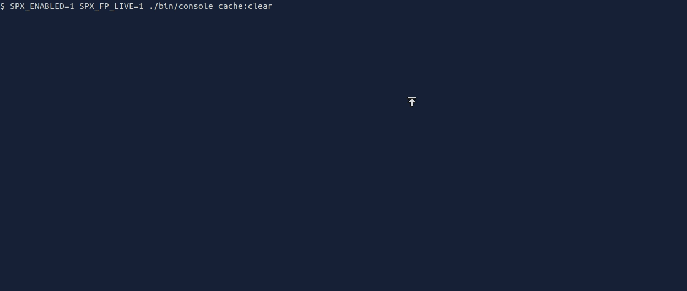

# SPX

[](https://travis-ci.org/NoiseByNorthwest/php-spx) 



SPX, which stands for _Simple Profiling eXtension_, is just another profiling extension for PHP.  
It differentiates itself from other similar extensions as being:
* totally free and confined to your infrastructure (i.e. no data leaks to a SaaS).
* very simple to use: just set an environment variable (command line) or switch on a radio button (web page) to profile your script. Thus, you are free of:
  * manually instrumenting your code (Ctrl-C a long running script is even supported as icing on the cake).
  * using a dedicated browser extension or command line launcher.
  * using a dedicated analysis tool.
* [multi metrics](#available-metrics) capable: 10 currently supported (various time metrics, memory, objects in use, I/O...).
* shipped with its web UI for report analysis which allows you to:
  * list all previously profiled script reports
  * select a report for in-depth analysis, featuring these interactive visualizations:
    * time line
    * flat profile
    * flame graph

## Requirements

Platforms support is currently quite limited. Feel free to open an issue if your platform is not supported.  
Current requirements are:

* x86-64
* GNU/Linux or macOS
* zlib dev package (e.g. zlib1g-dev on Debian based distro)
* PHP 5.6 & 7+
* Non-ZTS (threaded) build of PHP (ZTS support is theoretical)

## Installation

### Prerequisites

* PHP development package (corresponding to your installed PHP version).
* zlib development package:
  * For Debian based distros (including Ubuntu, Kubuntu...), just run: `sudo apt-get install zlib1g-dev`.

### Install the extension

```shell
git clone git@github.com:NoiseByNorthwest/php-spx.git
cd php-spx
phpize
./configure
make
sudo make install
```

Then add `extension=spx.so` to your *php.ini*, or in a dedicated *spx.ini* file created within the include directory.  
You may also want to override [default SPX configuration](#configuration) to be able to profile a web page.

## Development status

This is still **experimental**. API might change, features might be added or dropped, or development could be frozen.  

You can still safely use it in a **non-production** environment.  

Contributions are welcome but be aware of the experimental status of this project and **please follow the contribution rules** described here: [CONTRIBUTING.md](CONTRIBUTING.md)  

## Notes on accuracy

Being a tracing profiler, SPX is subject to accuracy issues with low cost functions since their costs are of the same order of magnitude than SPX probes overhead.  

This problem only concerns time related metrics (wall time, cpu time & idle time) as SPX probes do not consume other metrics.  

If you want to maximize accuracy for finding a time bottleneck, you should:
- avoid profiling internal functions.
- avoid collecting additional metrics.
- play with max depth parameter (SPX_DEPTH) to stop profiling at a given depth.

## Basic usage

### Command line script

Just prepend your command line with `SPX_ENABLED=1` to trigger profiling. You will get flat profile printed on STDOUT at the end of the execution, even if you abort it by hitting Ctrl-C, as in the following example:

```shell
$ SPX_ENABLED=1 composer update
Loading composer repositories with package information
Updating dependencies (including require-dev)
^C
*** SPX Report ***

Global stats:

  Called functions    :    19.2M
  Distinct functions  :      726

  Wall Time           :   24.14s
  ZE memory           :  506.3MB

Flat profile:

 Wall Time           | ZE memory           |
 Inc.     | *Exc.    | Inc.     | Exc.     | Called   | Function
----------+----------+----------+----------+----------+----------
    9.07s |    9.05s |   59.3MB |   59.0MB |       80 | Composer\Util\RemoteFilesystem::get
    3.23s |    3.23s |    9.8KB |    9.8KB |      108 | Composer\Cache::sha256
   10.48s |    1.62s |  256.3MB |  -52.2MB |      328 | Composer\DependencyResolver\RuleSetGenerator::addRulesForPackage
    2.42s |    1.15s |  100.0MB |  100.0MB |     1.2M | Composer\DependencyResolver\RuleSet::add
  760.6ms |  760.6ms |       0B |       0B |     1.2M | Composer\DependencyResolver\Rule2Literals::getHash
  726.5ms |  513.5ms |       0B |       0B |     1.2M | Composer\DependencyResolver\Rule2Literals::__construct
  544.0ms |  423.4ms |   37.1MB |   37.1MB |   470.1K | Composer\DependencyResolver\RuleWatchGraph::insert
  309.0ms |  232.2ms |       0B | -165.9MB |   470.1K | Composer\DependencyResolver\RuleWatchNode::__construct
  103.8ms |  103.8ms |       0B |       0B |   470.1K | Composer\DependencyResolver\RuleSetIterator::next
   69.3ms |   69.3ms |       0B |       0B |   470.1K | Composer\DependencyResolver\RuleSetIterator::current
```

### Web page

Assuming a development environment with the configuration [described here](#private-environment).  
Just open with your browser the following URL: `http(s)://<your application host>/_spx?SPX_KEY=dev` to access to SPX web UI control panel.  
Then switch on "Enabled". At this point profiling is enabled for the current domain and your current browser session through a set of dedicated cookies.  
Then refresh the web page you want to profile and refresh the control panel to see the generated report in the list below the control panel form.  

## Advanced usage

### Command line script

#### Available report types

Contrary to web page profiling which only support _full_ report type, command line script profiling supports several types of report.  
Here is the list below:

| Key  | Name  | Description  |
| ---- | ----- | ------------ |
| _fp_ | Flat profile | The flat profile provided by SPX. It is the **default report type** and is directly printed on STDOUT. |
| _full_ | Full report | This is the report type for web UI. Reports will be stored in SPX data directory and thus will be available for analysis on web UI side. |
| _trace_ | Trace file | A custom format (human readable text) trace file. |

#### Available parameters

| Name  | Default  | Description  |
| ----- | -------- | ------------ |
| SPX_ENABLED | `0` | Whether to enable SPX profiler (i.e. triggering profiling). When disabled there is no performance impact on your application. |
| SPX_BUILTINS | `0` | Whether to profile internal functions. |
| SPX_DEPTH | `0` | The stack depth at which profiling must stop (i.e. aggregate measures of deeper calls). 0 (default value) means unlimited. |
| SPX_METRICS | `wt,zm` | Comma separated list of [available metric keys](#available-metrics) to monitor. All report types take advantage of multi-metric profiling. |
| SPX_REPORT | `fp` | Selected [report key](#available-reports). |
| SPX_FP_FOCUS | `wt` | [Metric key](#available-metrics) for flat profile sort. |
| SPX_FP_INC | `0` | Whether to sort functions by inclusive value instead of exclusive value in flat profile. |
| SPX_FP_REL | `0` | Whether to display metric values as relative (i.e. percentage) in flat profile. |
| SPX_FP_LIMIT | `10` | The flat profile size (i.e. top N shown functions). |
| SPX_FP_LIVE | `0` | Whether to enabled flat profile live refresh. Since it uses ANSI escape sequences, it uses STDOUT as output, replacing script output (both STDOUT & STDERR). |
| SPX_FULL_RES | `0` | The time resolution for full report in micro seconds (0 means unlimited). When profiling a long running script, with a lot of function calls, this option will allow you to contain report size and thus keeping it small enough to be exploitable. |
| SPX_TRACE_SAFE | `0` | The trace file is by default written in a way to enforce accuracy, but in case of process crash (e.g. segfault) some logs could be lost. If you want to enforce durability (e.g. to find the last event before a crash) you just have to set this parameter to 1. |
| SPX_TRACE_FILE |  | Custom trace file name. If not specified it will be generated in `/tmp` and displayed on STDERR at the end of the script. |

#### Setting parameters

Well, as you might already noticed in corresponding [basic usage example](#command-line-script), setting a SPX parameter for a command line script simply means setting an environment variable with the same name.

### Web UI

SPX is shipped with its web UI for managing profile reports and especially analyze a given profile report.  

#### Supported browsers

Since the web UI uses advanced JavaScript features, only the following browsers are supported:
- most recent version of any Chromium-based browser.
- most recent version of Firefox with `dom.moduleScripts.enabled` preference set to `true`.

#### Control panel & report list

This is the home page of the web UI, divided into 2 parts:
- the control panel for setting the profiling setup for your current browser session.
- the profile report list as a sortable table. A click on a row allows to go to the analyze screen for the corresponding report.

#### Analyze screen

This page allows to ma

updated according to 2 dimensions (time and metric)

##### Metric selector

This is simply a combo box for selecting the metric

##### Time line overview

This visualization 

##### Time line focus

This visualization 

##### Flat profile

This visualization is the flat profile for the current time range and the current metric, displayed as a sortable table.

##### Flame Graph

This visualization, designed by [Brendan Gregg](http://www.brendangregg.com/flamegraphs.html), allows to quickly find the hot code path for the current time range and the current metric.  
Metrics corresponding to releasable resources (memory, objects in use...) are not supported by this visualization.

### Web page

#### Security concern

_The lack of review / feedback about this concern is the main reason **SPX cannot yet be considered as production ready**._

SPX allows you to profile web page as well as command line scripts, and also to list and analyze profile reports through its embedded web UI.  
This is why there is a huge security risk, since an attacker could:
 - steal SPX output and get sensible information about your application.
 - to a lesser extent, make a DoS attack against your application with a costly SPX profiling setup.

So, unless access to your application is already restricted at lower layer (i.e. before your application is hit, not by the application / PHP framework itself), a client triggering SPX profiling or accessing to the web UI must be authenticated.

SPX provides two-factor authentication with these 2 mandatory locks:
* IP address white list (exact string representation matching).
* Fixed secret random key (generated on your own) provided via a request header, cookie or query string parameter.

Thus a client can profile your application via a web page only if **its IP address is white listed and its provided key is valid**.

#### Configuration

| Name                  | Default  | Changeable  | Description  |
| --------------------- | -------- | ----------- | ------------ |
| spx.data_dir     | `/tmp/spx` | PHP_INI_SYSTEM | The directory where profiling reports will be stored. You may change it to point to a shared file system for example in case of multi-server architecture.  |
| spx.http_enabled      | `0`  | PHP_INI_SYSTEM | Whether to enable web UI and HTTP request profiling. |
| spx.http_key          |  | PHP_INI_SYSTEM | The secret key. You can use the following command to generate a 16 bytes random key as an hex string: `openssl rand -hex 16`. |
| spx.http_ip_var       | `REMOTE_ADDR` | PHP_INI_SYSTEM | The `$_SERVER` key holding the client IP address. Overriding the default value is required when your application is behind a reverse proxy. |
| spx.http_ip_whitelist |  | PHP_INI_SYSTEM | The IP address white list as a comma separated list of IP addresses. |
| spx.http_ui_assets_dir | `/usr/local/share/misc/php-spx/assets/web-ui` | PHP_INI_SYSTEM | The directory where the web UI files are installed. In most cases you do not have to change it. |
| spx.http_ui_uri_prefix | `/_spx` | PHP_INI_SYSTEM | The request-URI prefix to access to the web UI. You may change it for various reasons (additional security factor, conflict with existing URI, ...). |

##### Private environment

For your local & private development environment, since there is no need for authentication, you can use this configuration:

```
spx.http_enabled=1
spx.http_key="dev"
spx.http_ip_whitelist="127.0.0.1"
```

And then trigger profiling by appending `?SPX_KEY=dev&SPX_ENABLED=1` to your application URL.


### Metrics

#### Available metrics

| Key  | Name | Description |
| ---- | ---------------- | ------ |
| _wt_ | Wall Time | The absolute elapsed time. |
| _ct_ | CPU Time | The time spent while running on CPU. |
| _it_ | Idle Time | The time spent off-CPU, that means waiting for CPU, I/O completion, a lock acquisition... or explicitly sleeping. |
| _zm_ | Zend Engine memory | Zend Engine memory usage. Equivalent to `memory_get_usage(false)`. |
| _zr_ | Zend Engine root buffer length | Root buffer length, see explanation [here](http://php.net/manual/en/features.gc.collecting-cycles.php). It could be helpful to track pressure on garbage collector. |
| _zo_ | Zend Engine object count | Number of objects currently held by user code. |
| _ze_ | Zend Engine error count | Number of raised PHP errors. |
| _io_ | I/O (reads + writes) | Bytes read or written while performing I/O. |
| _ior_ | I/O (reads) | Bytes read while performing I/O. |
| _iow_ | I/O (writes) | Bytes written while performing I/O. |


_N.B.: I/O metrics are not supported on macOS._

### Reports


## Examples

### Command line script / trace file

The following command will trace all (user land) function calls of _./bin/console_ script in _trace.txt_ file.

```shell
$ SPX_ENABLED=1 SPX_OUTPUT=trace SPX_OUTPUT_FILE=trace.txt ./bin/console > /dev/null && head -20 trace.txt && echo ... && tail -20 trace.txt
 Wall Time                      | ZE memory                      |
 Cum.     | Inc.     | Exc.     | Cum.     | Inc.     | Exc.     | Depth    | Function
----------+----------+----------+----------+----------+----------+----------+----------
      0us |      0us |      0us |       0B |       0B |       0B |        1 | +/home/sylvain/dev/sf_app/bin/console
    994us |      0us |      0us |    1.3KB |       0B |       0B |        2 |  +/home/sylvain/dev/sf_app/vendor/autoload.php
    1.3ms |      0us |      0us |   11.3KB |       0B |       0B |        3 |   +/home/sylvain/dev/sf_app/vendor/composer/autoload_real.php
    1.3ms |      3us |      3us |   11.3KB |       0B |       0B |        3 |   -/home/sylvain/dev/sf_app/vendor/composer/autoload_real.php
    1.3ms |      0us |      0us |   10.9KB |       0B |       0B |        3 |   +ComposerAutoloaderInita657e2f64bf98eb70db4e96bba0d4058::getLoader
    1.3ms |      0us |      0us |   11.9KB |       0B |       0B |        4 |    +ComposerAutoloaderInita657e2f64bf98eb70db4e96bba0d4058::loadClassLoader
    2.3ms |      0us |      0us |   51.6KB |       0B |       0B |        5 |     +ComposerAutoloaderInita657e2f64bf98eb70db4e96bba0d4058::/home/sylvain/dev/sf_app/vendor/composer/ClassLoader.php
    2.3ms |      1us |      1us |   51.6KB |       0B |       0B |        5 |     -ComposerAutoloaderInita657e2f64bf98eb70db4e96bba0d4058::/home/sylvain/dev/sf_app/vendor/composer/ClassLoader.php
    2.3ms |    1.0ms |    1.0ms |   51.3KB |   39.4KB |   39.4KB |        4 |    -ComposerAutoloaderInita657e2f64bf98eb70db4e96bba0d4058::loadClassLoader
    2.7ms |      0us |      0us |   91.5KB |       0B |       0B |        4 |    +ComposerAutoloaderInita657e2f64bf98eb70db4e96bba0d4058::/home/sylvain/dev/sf_app/vendor/composer/autoload_static.php
    2.7ms |      1us |      1us |   91.5KB |       0B |       0B |        4 |    -ComposerAutoloaderInita657e2f64bf98eb70db4e96bba0d4058::/home/sylvain/dev/sf_app/vendor/composer/autoload_static.php
    2.7ms |      0us |      0us |   91.2KB |       0B |       0B |        4 |    +Composer\Autoload\ComposerStaticInita657e2f64bf98eb70db4e96bba0d4058::getInitializer
    2.7ms |      5us |      5us |   92.0KB |     856B |     856B |        4 |    -Composer\Autoload\ComposerStaticInita657e2f64bf98eb70db4e96bba0d4058::getInitializer
    2.7ms |      0us |      0us |   92.0KB |       0B |       0B |        4 |    +Composer\Autoload\ClassLoader::Composer\Autoload\{closure}
    2.7ms |      5us |      5us |   91.2KB |    -856B |    -856B |        4 |    -Composer\Autoload\ClassLoader::Composer\Autoload\{closure}
    2.7ms |      0us |      0us |   91.2KB |       0B |       0B |        4 |    +Composer\Autoload\ClassLoader::register
    2.7ms |      6us |      6us |   91.3KB |     128B |     128B |        4 |    -Composer\Autoload\ClassLoader::register
...
  126.6ms |   24.6ms |     10us |    6.1MB |  874.8KB |     488B |        4 |    -Symfony\Component\Console\Application::doRun
  126.6ms |   97.2ms |     27us |    6.1MB |    4.9MB |       0B |        3 |   -Symfony\Bundle\FrameworkBundle\Console\Application::doRun
  126.6ms |      0us |      0us |    6.1MB |       0B |       0B |        3 |   +Symfony\Component\Debug\ErrorHandler::handleFatalError
  126.6ms |      4us |      4us |    6.1MB |  -12.0KB |  -12.0KB |        3 |   -Symfony\Component\Debug\ErrorHandler::handleFatalError
  126.6ms |      0us |      0us |    6.1MB |       0B |       0B |        3 |   +Monolog\Handler\AbstractHandler::__destruct
  126.6ms |      0us |      0us |    6.1MB |       0B |       0B |        4 |    +Symfony\Bridge\Monolog\Handler\ConsoleHandler::close
  126.6ms |      0us |      0us |    6.1MB |       0B |       0B |        5 |     +Monolog\Handler\AbstractHandler::close
  126.6ms |      0us |      0us |    6.1MB |       0B |       0B |        5 |     -Monolog\Handler\AbstractHandler::close
  126.6ms |      1us |      1us |    6.1MB |       0B |       0B |        4 |    -Symfony\Bridge\Monolog\Handler\ConsoleHandler::close
  126.6ms |      3us |      2us |    6.1MB |       0B |       0B |        3 |   -Monolog\Handler\AbstractHandler::__destruct
  126.6ms |      0us |      0us |    6.1MB |       0B |       0B |        3 |   +Monolog\Handler\AbstractHandler::__destruct
  126.6ms |      0us |      0us |    6.1MB |       0B |       0B |        4 |    +Monolog\Handler\AbstractHandler::close
  126.6ms |      0us |      0us |    6.1MB |       0B |       0B |        4 |    -Monolog\Handler\AbstractHandler::close
  126.6ms |      0us |      0us |    6.1MB |       0B |       0B |        3 |   -Monolog\Handler\AbstractHandler::__destruct
  126.6ms |      0us |      0us |    6.1MB |       0B |       0B |        3 |   +Monolog\Handler\AbstractHandler::__destruct
  126.6ms |      0us |      0us |    6.1MB |       0B |       0B |        4 |    +Monolog\Handler\StreamHandler::close
  126.6ms |      2us |      2us |    6.1MB |       0B |       0B |        4 |    -Monolog\Handler\StreamHandler::close
  126.6ms |      2us |      0us |    6.1MB |       0B |       0B |        3 |   -Monolog\Handler\AbstractHandler::__destruct
  126.6ms |  105.6ms |     38us |    6.1MB |    5.2MB |     624B |        2 |  -Symfony\Component\Console\Application::run
  126.6ms |  126.6ms |    1.0ms |    6.1MB |    6.1MB |    1.6KB |        1 | -/home/sylvain/dev/sf_app/bin/console
```


## Credits

I have found lot of inspiration and hints reading:
 - [XHProf](https://github.com/phacility/xhprof)
 - [Xdebug](https://github.com/xdebug/xdebug)
 - [PHP](https://github.com/php/php-src)
