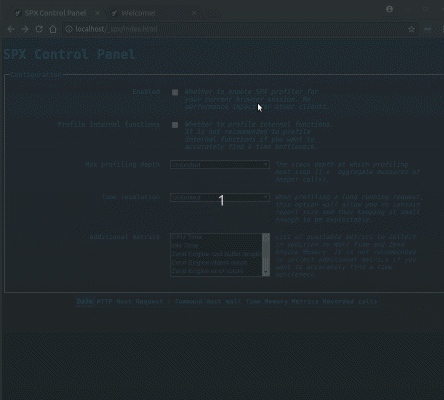
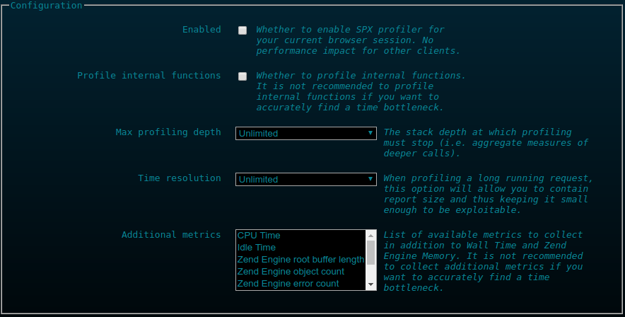
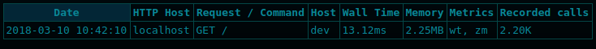
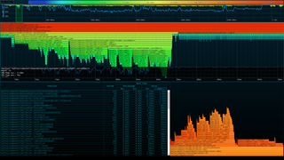
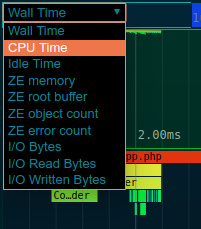
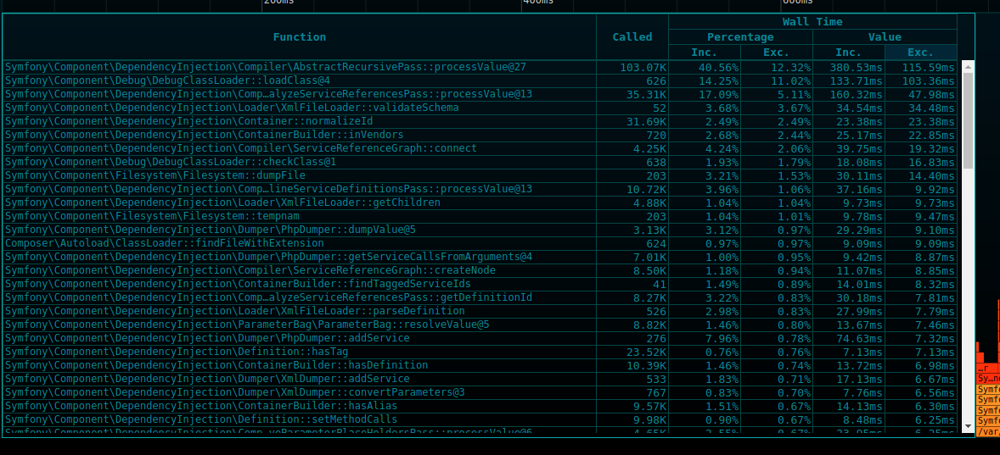
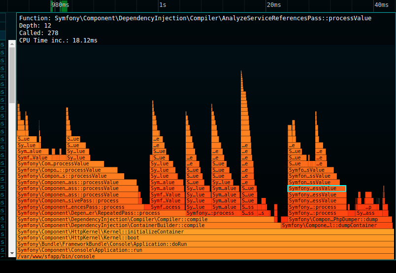

# SPX - A simple profiler for PHP

[](https://travis-ci.org/NoiseByNorthwest/php-spx) 




SPX, which stands for _Simple Profiling eXtension_, is just another profiling extension for PHP.  
It differentiates itself from other similar extensions as being:
* totally free and confined to your infrastructure (i.e. no data leaks to a SaaS).
* very simple to use: just set an environment variable (command line) or switch on a radio button (web page) to profile your script. Thus, you are free of:
  * manually instrumenting your code (Ctrl-C a long running command line script is even supported).
  * using a dedicated browser extension or command line launcher.
* [multi metrics](#available-metrics) capable: 10 currently supported (various time metrics, memory, objects in use, I/O...).
* shipped with its [web UI](#web-ui) which allows to:
  * enable / configure profiling for the current browser session
  * list profiled script reports
  * select a report for in-depth analysis, featuring these interactive visualizations:
    * time line
    * flat profile
    * flame graph

## Requirements

Platforms support is currently quite limited. Feel free to open an issue if your platform is not supported.  
Current requirements are:

* x86-64
* **GNU/Linux** or **macOS**
* zlib dev package (e.g. zlib1g-dev on Debian based distro)
* PHP 5.6 & 7+
* Non-ZTS (threaded) build of PHP (ZTS support is theoretical)

## Installation

### Prerequisites

* PHP development package (corresponding to your installed PHP version).
* zlib development package:
  * For Debian based distros (including Ubuntu, Kubuntu...), just run: `sudo apt-get install zlib1g-dev`.

### Install the extension

```shell
git clone git@github.com:NoiseByNorthwest/php-spx.git
cd php-spx
phpize
./configure
make
sudo make install
```

Then add `extension=spx.so` to your *php.ini*, or in a dedicated *spx.ini* file created within the include directory.  
You may also want to override [default SPX configuration](#configuration) to be able to profile a web page, with [this one](#private-environment) for example for a local development environment.

## Development status

This is still **experimental**. API might change, features might be added or dropped, or development could be frozen.  

You can still safely use it in a **non-production** environment.  

Contributions are welcome but be aware of the experimental status of this project and **please follow the contribution rules** described here: [CONTRIBUTING.md](CONTRIBUTING.md)  

## Basic usage

### Web page

Assuming a development environment with the configuration [described here](#private-environment) and your application is accessible via `http://localhost`.  

Just open with your browser the following URL: `http://localhost/_spx?SPX_KEY=dev` to access to the web UI [control panel](#control-panel). You will see the following form:



Then switch on "Enabled". At this point profiling is enabled for the current domain and your current browser session through a set of dedicated cookies.  

Then refresh the web page you want to profile and refresh the control panel to see the generated report in the list below the control panel form.  



Then click on the report in the list and enjoy the [analysis screen](#analysis-screen).  

### Command line script

#### Instant flat profile

Just prepend your command line with `SPX_ENABLED=1` to trigger profiling. You will get the flat profile printed on STDOUT at the end of the execution, even if you abort it by hitting Ctrl-C, as in the following example:

```shell
$ SPX_ENABLED=1 composer update
Loading composer repositories with package information
Updating dependencies (including require-dev)
^C
*** SPX Report ***

Global stats:

  Called functions    :    27.5K
  Distinct functions  :      714

  Wall Time           :    7.39s
  ZE memory           :   62.6MB

Flat profile:

 Wall Time           | ZE memory           |
 Inc.     | *Exc.    | Inc.     | Exc.     | Called   | Function
----------+----------+----------+----------+----------+----------
  101.6ms |  101.6ms |   41.8MB |   41.8MB |       12 | Composer\Json\JsonFile::parseJson
   53.6ms |   53.6ms |     544B |     544B |        4 | Composer\Cache::sha256
    6.91s |   41.5ms |   41.5MB |   -7.5MB |        4 | Composer\Repository\ComposerRepository::fetchFile
    6.85s |   32.3ms |   47.5MB |    5.4MB |        5 | 1@Composer\Repository\ComposerRepository::loadProviderListings
    7.8ms |    7.8ms |       0B |       0B |        4 | Composer\Cache::write
    1.1ms |    1.1ms |     -72B |     -72B |        1 | Composer\Console\Application::Composer\Console\{closure}
  828.5us |  828.5us |     976B |     976B |       12 | Composer\Util\RemoteFilesystem::findHeaderValue
  497.6us |  491.0us |  710.2KB |  710.2KB |        1 | Composer\Cache::read
    2.4ms |  332.6us |   20.9KB | -378.8KB |       34 | 3@Symfony\Component\Finder\Iterator\FilterIterator::rewind
  298.9us |  298.9us |    2.2KB |    2.2KB |       47 | Symfony\Component\Finder\Iterator\FileTypeFilterIterator::accept
```

N.B.: Just add `SPX_FP_LIVE=1` to enable the live refresh of the flat profile during script execution.

#### Generate profiling report for the web UI

You just have to specify `SPX_REPORT=full` to generate a report available via the web UI:

```shell
SPX_ENABLED=1 SPX_REPORT=full ./bin/console cache:clear
```

## Advanced usage

### Configuration

| Name                  | Default  | Changeable  | Description  |
| --------------------- | -------- | ----------- | ------------ |
| spx.data_dir     | `/tmp/spx` | PHP_INI_SYSTEM | The directory where profiling reports will be stored. You may change it to point to a shared file system for example in case of multi-server architecture.  |
| spx.http_enabled      | `0`  | PHP_INI_SYSTEM | Whether to enable web UI and HTTP request profiling. |
| spx.http_key          |  | PHP_INI_SYSTEM | The secret key used for authentication (see [security concern](#security-concern) for more details). You can use the following command to generate a 16 bytes random key as an hex string: `openssl rand -hex 16`. |
| spx.http_ip_var       | `REMOTE_ADDR` | PHP_INI_SYSTEM | The `$_SERVER` key holding the client IP address used for authentication (see [security concern](#security-concern) for more details). Overriding the default value is required when your application is behind a reverse proxy. |
| spx.http_ip_whitelist |  | PHP_INI_SYSTEM | The IP address white list used for authentication as a comma separated list of IP addresses. |
| spx.http_ui_assets_dir | `/usr/local/share/misc/php-spx/assets/web-ui` | PHP_INI_SYSTEM | The directory where the [web UI](#web-ui) files are installed. In most cases you do not have to change it. |
| spx.http_ui_uri_prefix | `/_spx` | PHP_INI_SYSTEM | The request-URI prefix to access to the [web UI](#web-ui). You may change it for various reasons (additional security factor, conflict with existing URI, ...). |

#### Private environment

For your local & private development environment, since there is no need for authentication, you can use this configuration:

```
spx.http_enabled=1
spx.http_key="dev"
spx.http_ip_whitelist="127.0.0.1"
```

And then access to the web UI at `http(s)://<your application host>/_spx?SPX_KEY=dev`.

### Available metrics

Here is the list of available metrics to collect. By default only _Wall Time_ and _Zend Engine memory_ are collected.

| Key (command line) | Name | Description |
| ---- | ---------------- | ------ |
| _wt_ | Wall Time | The absolute elapsed time. |
| _ct_ | CPU Time | The time spent while running on CPU. |
| _it_ | Idle Time | The time spent off-CPU, that means waiting for CPU, I/O completion, a lock acquisition... or explicitly sleeping. |
| _zm_ | Zend Engine memory | Zend Engine memory usage. Equivalent to `memory_get_usage(false)`. |
| _zr_ | Zend Engine root buffer length | Root buffer length, see explanation [here](http://php.net/manual/en/features.gc.collecting-cycles.php). It could be helpful to track pressure on garbage collector. |
| _zo_ | Zend Engine object count | Number of objects currently held by user code. |
| _ze_ | Zend Engine error count | Number of raised PHP errors. |
| _io_ | I/O (reads + writes) | Bytes read or written while performing I/O. |
| _ior_ | I/O (reads) | Bytes read while performing I/O. |
| _iow_ | I/O (writes) | Bytes written while performing I/O. |

_N.B.: I/O metrics are not supported on macOS._

### Command line script

#### Available report types

Contrary to web page profiling which only support _full_ report type (the one exploitable by the web UI), command line script profiling supports several types of report.  
Here is the list below:

| Key  | Name  | Description  |
| ---- | ----- | ------------ |
| _fp_ | Flat profile | The flat profile provided by SPX. It is the **default report type** and is directly printed on STDOUT. |
| _full_ | Full report | This is the report type for web UI. Reports will be stored in SPX data directory and thus will be available for analysis on web UI side. |
| _trace_ | Trace file | A custom format (human readable text) trace file. |

#### Available parameters

| Name  | Default  | Description  |
| ----- | -------- | ------------ |
| _SPX_ENABLED_ | `0` | Whether to enable SPX profiler (i.e. triggering profiling). When disabled there is no performance impact on your application. |
| _SPX_BUILTINS_ | `0` | Whether to profile internal functions. |
| _SPX_DEPTH_ | `0` | The stack depth at which profiling must stop (i.e. aggregate measures of deeper calls). 0 (default value) means unlimited. |
| _SPX_METRICS_ | `wt,zm` | Comma separated list of [available metric keys](#available-metrics) to collect. All report types take advantage of multi-metric profiling. |
| _SPX_REPORT_ | `fp` | Selected [report key](#available-report-types). |
| _SPX_FP_FOCUS_ | `wt` | [Metric key](#available-metrics) for flat profile sort. |
| _SPX_FP_INC_ | `0` | Whether to sort functions by inclusive value instead of exclusive value in flat profile. |
| _SPX_FP_REL_ | `0` | Whether to display metric values as relative (i.e. percentage) in flat profile. |
| _SPX_FP_LIMIT_ | `10` | The flat profile size (i.e. top N shown functions). |
| _SPX_FP_LIVE_ | `0` | Whether to enabled flat profile live refresh. Since it uses ANSI escape sequences, it uses STDOUT as output, replacing script output (both STDOUT & STDERR). |
| _SPX_FULL_RES_ | `0` | The time resolution for full report in micro seconds (0 means unlimited). When profiling a long running & CPU intensive script, this option will allow you to contain report size and thus keeping it small enough to be exploitable by the [web UI](#web-ui). See [here](#performance-report-size--time-resolution) for more details. |
| _SPX_TRACE_SAFE_ | `0` | The trace file is by default written in a way to enforce accuracy, but in case of process crash (e.g. segfault) some logs could be lost. If you want to enforce durability (e.g. to find the last event before a crash) you just have to set this parameter to 1. |
| _SPX_TRACE_FILE_ |  | Custom trace file name. If not specified it will be generated in `/tmp` and displayed on STDERR at the end of the script. |

#### Setting parameters

Well, as you might already noticed in corresponding [basic usage example](#command-line-script), setting a SPX parameter for a command line script simply means setting an environment variable with the same name.

### Web UI

#### Supported browsers

Since the web UI uses advanced JavaScript features, only the following browsers are supported:
- most recent version of any Chromium-based browser.
- most recent version of Firefox with `dom.moduleScripts.enabled` preference set to `true`.

_You will have the best user experience with a Chromium-based browser._

#### Control panel & report list

This is the home page of the web UI, divided into 2 parts:
- the control panel for setting the profiling setup for your current browser session.
- the profile report list as a sortable table. A click on a row allows to go to the [analysis screen](#analysis-screen) for the corresponding report.

#### Analysis screen



##### Performance, report size & time resolution

The analysis screen can nicely handle profile reports with up to several (5+) millions of recorded function calls with Chromium on my i5 @ 3.3GHz / 8GB desktop.  
In case you want to profile a long running, CPU intensive, script which tends to generate giant reports, you can change the time resolution of the report to skip the shortest function calls (i.e. those with execution time below the given resolution).  
See _SPX_FULL_RES_ [parameter](#available-parameters) for command line script.

##### Metric selector

This is simply a combo box for selecting the currently analyzed metric.



##### Time line overview

This visualization is the time line overview of all called functions.
You can change the selected time range by, represented by a transparent green rectangle, by simply dragging it horizontally.

Except for wall time, the current metric is also plotted (current value over time) on a foreground layer.

Supported controls:
- horizontal left click drag: shift the selected time range
- resize click on selected time range rectangle: shift one of the selected time range boundary


##### Time line focus

This visualization is an interactive time line which is able to control and keep focus on the selected time range.

Supported controls:
- left click drag: time range shift (horizontal) or depth range shift (vertical)
- middle click vertical drag: time range zoom in/out
- mouse wheel: time range zoom in/out
- hovering a function call to show more details
- double click on a function call: set the current time range as the one of the selected function call

Except for wall time, the current metric is also plotted (current value over time) on a foreground layer.


##### Flat profile

This visualization is the flat profile for the selected time range and the selected metric, displayed as a sortable table.



##### Flame Graph

This visualization, designed by [Brendan Gregg](http://www.brendangregg.com/flamegraphs.html), allows to quickly find the hot code path for the selected time range and the selected metric.  
Metrics corresponding to releasable resources (memory, objects in use...) are not supported by this visualization.



## Security concern

_The lack of review / feedback about this concern is the main reason **SPX cannot yet be considered as production ready**._

SPX allows you to profile web page as well as command line scripts, and also to list and analyze profile reports through its embedded web UI.  
This is why there is a huge security risk, since an attacker could:
 - access to web UI and get sensible information about your application.
 - to a lesser extent, make a DoS attack against your application with a costly profiling setup.

So, unless access to your application is already restricted at lower layer (i.e. before your application is hit, not by the application / PHP framework itself), a client triggering profiling or accessing to the web UI must be authenticated.

SPX provides two-factor authentication with these 2 mandatory locks:
* IP address white list (exact string representation matching).
* Fixed secret random key (generated on your own) provided via a request header, cookie or query string parameter.

Thus a client can profile your application via a web page only if **its IP address is white listed and its provided key is valid**.

## Notes on accuracy

Being a tracing profiler, SPX is subject to accuracy issues for time related metrics when the measured function execution time is:
- close or lower than the timer precision
- close or lower than SPX's own per function overhead

The first issue is mitigated by using the highest resolution timer provided by the platform. On Linux & recent macOS versions the timer resolution is 1ns; on macOS before 10.12/Sierra, the timer resolution is only 1us.

The second issue is mitigated by taking in account SPX time (wall / cpu) overhead by subtracting it to measured function execution time. This is done by evaluating SPX constant per function overhead before starting profiling the script.

However, whatever the platform, if you want to maximize accuracy to find a time bottleneck, you should also:
- avoid profiling internal functions.
- avoid collecting additional metrics.
- try to play with maximum depth parameter to stop profiling at a given depth.

## Examples

### Command line script: generate trace file

The following command will trace all (user) function calls of _./bin/console_ script in _trace.txt_ file.

```shell
$ SPX_ENABLED=1 SPX_REPORT=trace SPX_TRACE_FILE=trace.txt ./bin/console > /dev/null && head -20 trace.txt && echo ... && tail -20 trace.txt

SPX trace file: trace.txt
 Wall Time                      | ZE memory                      |
 Cum.     | Inc.     | Exc.     | Cum.     | Inc.     | Exc.     | Depth    | Function
----------+----------+----------+----------+----------+----------+----------+----------
      0ns |      0ns |      0ns |       0B |       0B |       0B |        1 | +/var/www/sfapp/bin/console
  111.8us |      0ns |      0ns |    1.6KB |       0B |       0B |        2 |  +main
  274.2us |      0ns |      0ns |   14.9KB |       0B |       0B |        3 |   +main
  275.3us |    1.0us |    1.0us |   14.9KB |       0B |       0B |        3 |   -main
  278.6us |      0ns |      0ns |   14.5KB |       0B |       0B |        3 |   +ComposerAutoloaderInitff0faccf08b80bfc8761e2c1e69c7292::getLoader
  298.4us |      0ns |      0ns |   15.4KB |       0B |       0B |        4 |    +ComposerAutoloaderInitff0faccf08b80bfc8761e2c1e69c7292::loadClassLoader
  591.7us |      0ns |      0ns |   74.9KB |       0B |       0B |        5 |     +main
  592.5us |    784ns |    784ns |   74.9KB |       0B |       0B |        5 |     -main
  593.0us |  294.6us |  293.8us |   74.3KB |   59.0KB |   59.0KB |        4 |    -ComposerAutoloaderInitff0faccf08b80bfc8761e2c1e69c7292::loadClassLoader
  799.5us |      0ns |      0ns |  119.1KB |       0B |       0B |        4 |    +main
  800.1us |    623ns |    623ns |  119.1KB |       0B |       0B |        4 |    -main
  802.7us |      0ns |      0ns |  118.7KB |       0B |       0B |        4 |    +Composer\Autoload\ComposerStaticInitff0faccf08b80bfc8761e2c1e69c7292::getInitializer
  809.5us |    6.8us |    6.8us |  119.6KB |     912B |     912B |        4 |    -Composer\Autoload\ComposerStaticInitff0faccf08b80bfc8761e2c1e69c7292::getInitializer
  812.6us |      0ns |      0ns |  119.7KB |       0B |       0B |        4 |    +Composer\Autoload\ClassLoader::Composer\Autoload\{closure}
  820.3us |    7.8us |    7.8us |  119.8KB |      48B |      48B |        4 |    -Composer\Autoload\ClassLoader::Composer\Autoload\{closure}
  822.1us |      0ns |      0ns |  118.9KB |       0B |       0B |        4 |    +Composer\Autoload\ClassLoader::register
  828.7us |    6.6us |    6.6us |  119.1KB |     208B |     208B |        4 |    -Composer\Autoload\ClassLoader::register
...
  129.2ms |      0ns |      0ns |   14.6MB |       0B |       0B |        3 |   +/var/www/sfapp/vendor/symfony/symfony/src/Symfony/Component/Cache/Traits/FilesystemCommonTrait.php
  129.2ms |      0ns |      0ns |   14.6MB |       0B |       0B |        4 |    +Symfony\Component\Cache\Adapter\AbstractAdapter::__destruct
  129.2ms |    190ns |    190ns |   14.6MB |       0B |       0B |        4 |    -Symfony\Component\Cache\Adapter\AbstractAdapter::__destruct
  129.2ms |    853ns |    663ns |   14.6MB |      48B |      48B |        3 |   -/var/www/sfapp/vendor/symfony/symfony/src/Symfony/Component/Cache/Traits/FilesystemCommonTrait.php
  129.2ms |      0ns |      0ns |   14.6MB |       0B |       0B |        3 |   +/var/www/sfapp/vendor/symfony/symfony/src/Symfony/Component/Cache/Adapter/AbstractAdapter.php
  129.2ms |    308ns |    308ns |   14.6MB |      48B |      48B |        3 |   -/var/www/sfapp/vendor/symfony/symfony/src/Symfony/Component/Cache/Adapter/AbstractAdapter.php
  129.2ms |      0ns |      0ns |   14.6MB |       0B |       0B |        3 |   +/var/www/sfapp/vendor/symfony/symfony/src/Symfony/Component/Cache/Traits/FilesystemCommonTrait.php
  129.2ms |      0ns |      0ns |   14.6MB |       0B |       0B |        4 |    +Symfony\Component\Cache\Adapter\AbstractAdapter::__destruct
  129.2ms |    237ns |    237ns |   14.6MB |       0B |       0B |        4 |    -Symfony\Component\Cache\Adapter\AbstractAdapter::__destruct
  129.2ms |    851ns |    614ns |   14.6MB |      48B |      48B |        3 |   -/var/www/sfapp/vendor/symfony/symfony/src/Symfony/Component/Cache/Traits/FilesystemCommonTrait.php
  129.2ms |      0ns |      0ns |   14.6MB |       0B |       0B |        3 |   +/var/www/sfapp/vendor/symfony/symfony/src/Symfony/Component/Cache/Adapter/AbstractAdapter.php
  129.2ms |    154ns |    154ns |   14.6MB |      48B |      48B |        3 |   -/var/www/sfapp/vendor/symfony/symfony/src/Symfony/Component/Cache/Adapter/AbstractAdapter.php
  129.2ms |      0ns |      0ns |   14.6MB |       0B |       0B |        3 |   +/var/www/sfapp/vendor/symfony/symfony/src/Symfony/Component/Cache/Traits/FilesystemCommonTrait.php
  129.2ms |      0ns |      0ns |   14.6MB |       0B |       0B |        4 |    +Symfony\Component\Cache\Adapter\AbstractAdapter::__destruct
  129.2ms |    172ns |    172ns |   14.6MB |       0B |       0B |        4 |    -Symfony\Component\Cache\Adapter\AbstractAdapter::__destruct
  129.2ms |    717ns |    545ns |   14.6MB |      48B |      48B |        3 |   -/var/www/sfapp/vendor/symfony/symfony/src/Symfony/Component/Cache/Traits/FilesystemCommonTrait.php
  129.2ms |      0ns |      0ns |   14.6MB |       0B |       0B |        3 |   +/var/www/sfapp/vendor/symfony/symfony/src/Symfony/Component/Cache/Adapter/AbstractAdapter.php
  129.2ms |    244ns |    244ns |   14.6MB |      48B |      48B |        3 |   -/var/www/sfapp/vendor/symfony/symfony/src/Symfony/Component/Cache/Adapter/AbstractAdapter.php
  129.2ms |  120.6ms |   84.5us |   14.6MB |   13.2MB |    3.1KB |        2 |  -Symfony\Component\Console\Application::run
  129.2ms |  129.2ms |  134.1us |   14.6MB |   14.6MB |    2.1KB |        1 | -/var/www/sfapp/bin/console
```

## Credits

I have found lot of inspiration and hints reading:
 - [XHProf](https://github.com/phacility/xhprof)
 - [Xdebug](https://github.com/xdebug/xdebug)
 - [PHP](https://github.com/php/php-src)
